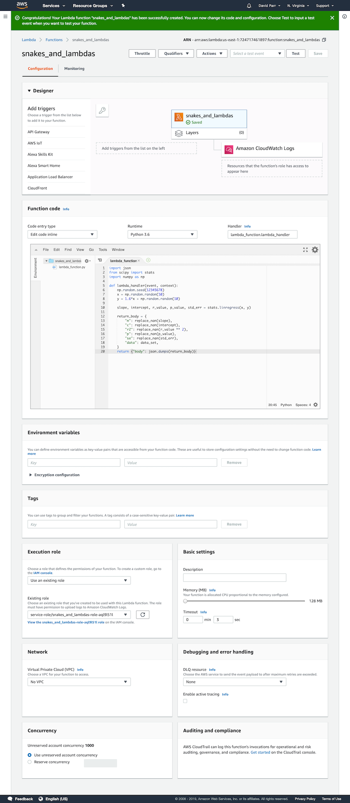
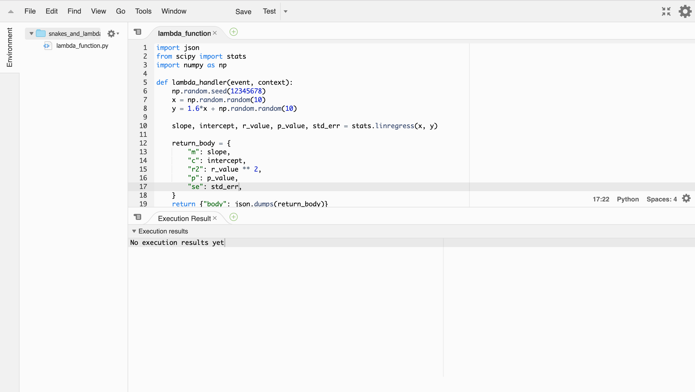
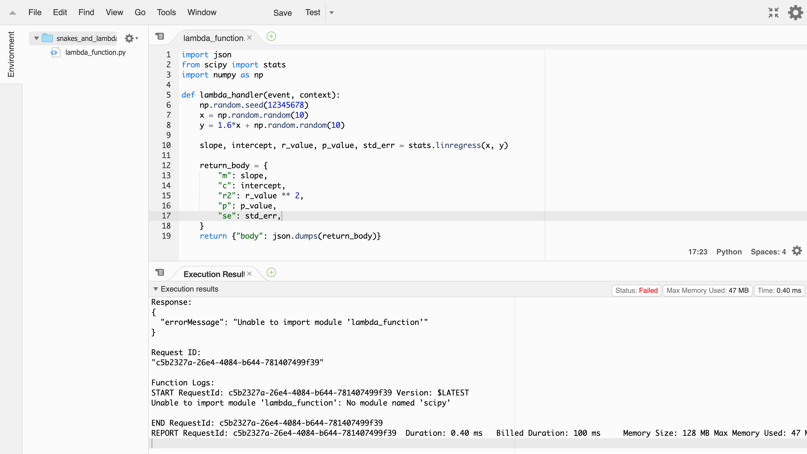
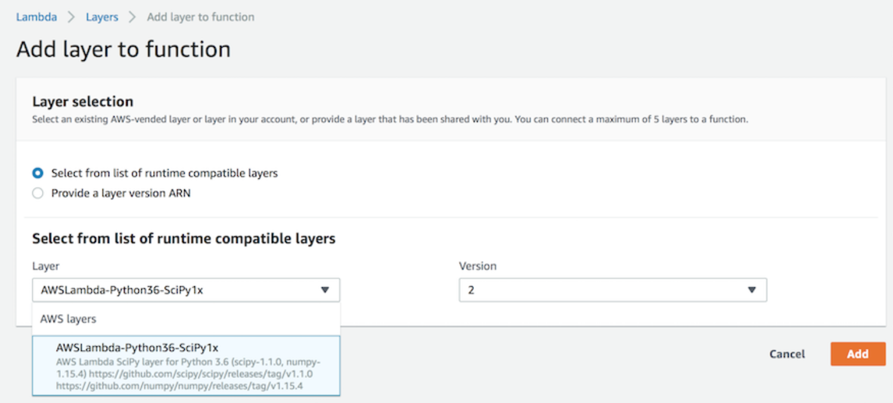
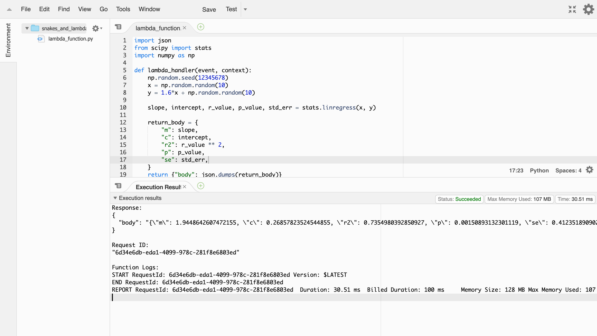
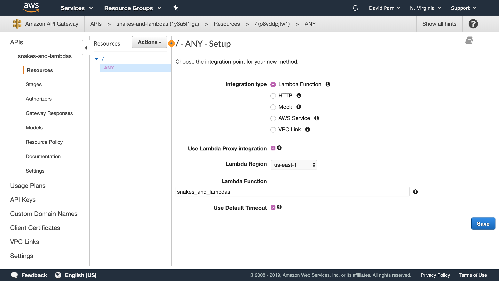
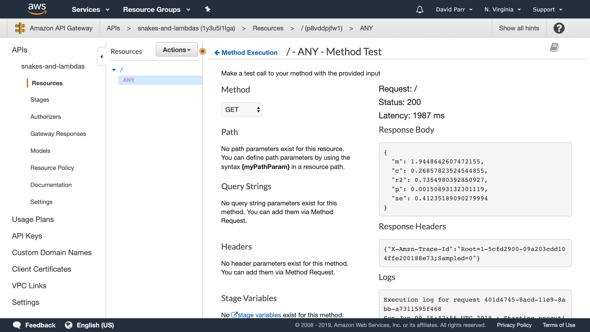
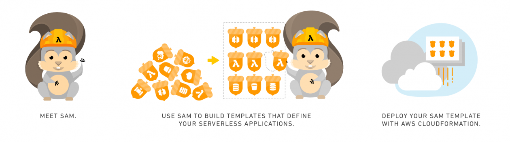

## Snakes And Lambdas

- what is lambda
- why is lambda (for data science)
- how is lambda (to actually use)
- when is lambda (the right choice)

---~

## What is lambda?

- serverless
    - it runs on servers, you just don't deal with that

- scaleable
    - it only costs when running, you just pay more as it does more

- micro-service
    - it only does one small thing, you just have lots of different ones

---~

## What is lambda?

1. Start a new lambda
2. Set up lambda with user code - "cold start"
3. Accept event 1 and process
4. Wait
   1. Accept event 2 and process - "warmed up"
   2. Timeout and kill lambda

There can be multiple _concurrent_ machines too

---~

## What is lambda?

- Pay only for what you use
- Manage only what you have to
- Deal with extra/new/bursty traffic seamlessly

---~

## Why is lambda?
#### (for data science)

- data-scientists != dev-ops professionals
    - but our work needs to be 'released'
- all data projects != ensemble xg-boost Keras TPU shenanigans
    - "No ML is easier to manage than no ML" &copy; [@julsimon](https://twitter.com/julsimon/status/1124383078313537536)
- data-projects != single-goal monolithic systems
    - separate concerns, code bases and complication

---~

## How is lambda?
#### (to actually use)

1. write your python
2. lambda your python
3. ???
4. profit

---

## 1. Write your python

``` python
from scipy import stats
np.random.seed(12345678)
x = np.random.random(10)
y = 1.6*x + np.random.random(10)
slope, intercept, r_value, p_value, std_err = 
    stats.linregress(x, y)
```

---

## 2. Lambda your python

- _event driven_
  - an `event` is passed to a `handler function`
- _json formatted_
  - `events` are `json`
  - `handler functions` return `json`

---~

## 2. Lambda your python

``` python
import json
from scipy import stats
import numpy as np

def lambda_handler(event, context):
    np.random.seed(12345678)
    x = np.random.random(10)
    y = 1.6*x + np.random.random(10)
    slope, intercept, r_value, p_value, std_err = stats.linregress(x, y) 
    return_body = {
        "m": slope, "c": intercept,"r2": r_value ** 2, 
        "p": p_value, "se": std_err
    }
    return {"body": json.dumps(return_body)}
```

---~

## 2. Lambda your python

 <!-- .element height="25%" width="25%" -->

---~

## 2. Lambda your python



---~

## 2. Lambda your python



---

## 3. ???????
### (1. Layers)

- `json` is _built in by default_
  - so it `boto3`

**PROBLEM**
- lambda doesn't `pip install ....`

**SOLUTION**
- use `layers`
  - numpy, scipy are _[published by aws](https://aws.amazon.com/blogs/aws/new-for-aws-lambda-use-any-programming-language-and-share-common-components/)_

---~

## 3.1 Layers



---~

## 3.1 Layers



---

## 3. ???????
### (2 Custom Layers)

**PROBLEM**
- New requirement needs pandas

**SOLUTION**
- Create custom `layer`
    - pre-compiled code on a specific path deployed as a `.zip`
    - for 'any package' * using some [shell and docker](https://medium.com/@qtangs/creating-new-aws-lambda-layer-for-python-pandas-library-348b126e9f3e)
        + \* YMMV

---~

## 3.2 Custom Layers

requirements.txt
```
pandas==0.23.4
pytz==2018.7
```

get_layer_packages.sh
``` bash
#!/bin/bash

export PKG_DIR="python"

rm -rf ${PKG_DIR} && mkdir -p ${PKG_DIR}

docker run --rm -v $(pwd):/foo -w /foo lambci/lambda:build-python3.6 \
    pip install -r requirements.txt --no-deps -t ${PKG_DIR}
```

---~

## 3.2 Custom Layers

execute.sh
``` bash
chmod +x get_layer_packages.sh
./get_layer_packages.sh
zip -r pandas.zip . -i "python/*"
```

Then upload + create as layer with `aws-cli` or manually with console

---~
 
## 3.2 Custom Layers

'any package' *
- `pandas`
- `pymysql`
  - `lambda` needs to be _inside_ the same VPC
- `statsmodels`

---

## 3. ???????
### (3 api gateway)

**PROBLEM**
- How does your team use your work? 

**SOLUTION**
- use `api gateway`
  - AWS service that puts [REST api in front of the lambda](https://hackersandslackers.com/create-a-rest-api-endpoint-using-aws-lambda/)

---~

## 3.3 Api gateway



---~

## 3.3 Api gateway



---~

## 3.3 Api gateway

Get help from an adult (dev-ops professional)


---~

## 3.3 Api gateway

If you can't find an adult

- be careful about exposing the api
  - not _obvious_ how and where it can be accessed
    - resource policies
- `swagger` is an api templating syntax
  - cloud formation
- click the 'deploy api' button after _every_ change
  - use multiple stages

---

## 3. ???????
### (4 local dev - cloud deploy)

**PROBLEM**
- copy-pasta code into console is _bad_

**SOLUTION**
- use [`AWS SAM` cli](https://aws.amazon.com/blogs/compute/working-with-aws-lambda-and-lambda-layers-in-aws-sam/)
  - local development + testing with docker
  - 'cloudy' deployment with cloudfront cli

---~

## 3.4 local dev - cloud deploy



---~

## 3.4 local dev - cloud deploy

``` bash
Usage: sam [OPTIONS] COMMAND [ARGS]...

Commands:
  local     Run your Serverless application locally 
            for quick development & testing.
  logs      Fetch logs for a function
  deploy    Deploy an AWS SAM application. This is an alias 
            for 'aws cloudformation deploy'.
  build     Build your Lambda function code
  publish   Publish a packaged AWS SAM template to the AWS 
            Serverless Application Repository.
  init      Initialize a serverless application.
  validate  Validate an AWS SAM template.
  package   Package an AWS SAM application. This is an alias 
            for 'aws cloudformation package'.
```

---~

## 3.4 local dev - cloud deploy

Workflow
- `sam init`
- `sam local generate-event apigateway aws-proxy`
    - `sam build` 
        -  <span>&#x21F5;</span>
    - `sam local invoke -e event.json`
---~

## 3.4 local dev - cloud deploy

``` bash
alias playitsam='sam build && sam local invoke -e event.json'
alias playitagainsam='sam build && sam local invoke -e'
```

---~

## 3.4 local dev - cloud deploy


- `sam validate`
- `sam package`
- `sam deploy`


Get help from an adult (dev-ops professional)

---

## 4. Profit


Surple have 3 lambda data services

---~

### linear regression
#### 'Degree Days vs Energy = Efficiency'

- user triggered event
- queries specific data based on user selection
- user facing visualisation
- vpc cold starts

 <!-- .element height="70%" width="70%" -->

---~

### time-series analysis
#### 'Smart Targets'

- scheduled for all meters as ETL to DB
- highlight 'out of character' energy use
- user facing visualisation and notifications

 <!-- .element height="70%" width="70%" -->

---~

### anomaly detection
#### 'Smart Alarms'

- scheduled for all meters as ETL to DB
- highlight 'extreme' energy use
- user email and notifications
- this was extra fun/complicated
  - Ask me how

---

## Practical notes

- tweaking cpu load has made more a difference than tweaking timeout
- taking the time to set up SAM correctly has saved at least the time of browser console work alone
- A Cloud Guru is built on lambda ([cheaply?](https://aws.amazon.com/lambda/pricing/))
  - And has some [great material on it](https://acloud.guru/learn/aws-lambda)

---~

## When is lambda?
#### (the right choice)

Good case
- 'traditional' models
  - regression, timeseries, hopefully more...
- per 'reasonable' data set
  - `for each`
- 'now in a minute'
 - (not actually a minute, more like seconds)
- 'bursty'
  - some, or lots of people need it then no one does

---~

## When is lambda?
#### (the right choice)

Bad case
- 'fancy' models
  - RAM limits, CPU limits
- whole scale
  - `across all`
- immediate response
  - can't afford a cold start
- 24:7 flat load
  - need 100% load 100% of the time

---~

## Thank you

Slides available: [https://github.com/DaveParr/snakes_and_lambdas](https://github.com/DaveParr/snakes_and_lambdas)
Twitter: [@DaveParr](https://twitter.com/DaveParr)

---

## **'Smart Alarms' actually runs in**


---~

## Runtime Layers

**PROBLEM**
- The thing I want to use isn't in Python
  - or Go, NodeJS, C#, Java

**SOLUTION**
- use `Runtime Layers`
  - any language compiled into a layer
  - accessed via `bash` or similar that processes event and passes to runtime
  - [`bakdata/aws-lambda-r-runtime`](https://github.com/bakdata/aws-lambda-r-runtime)